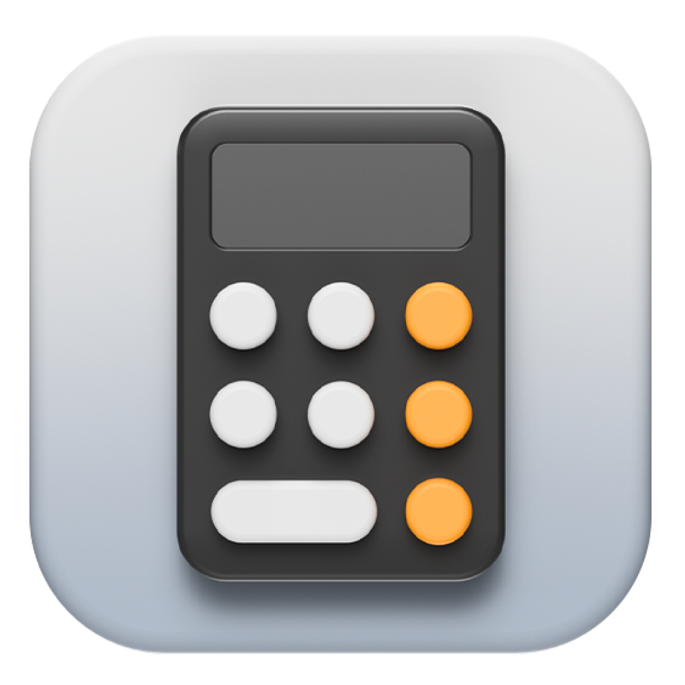
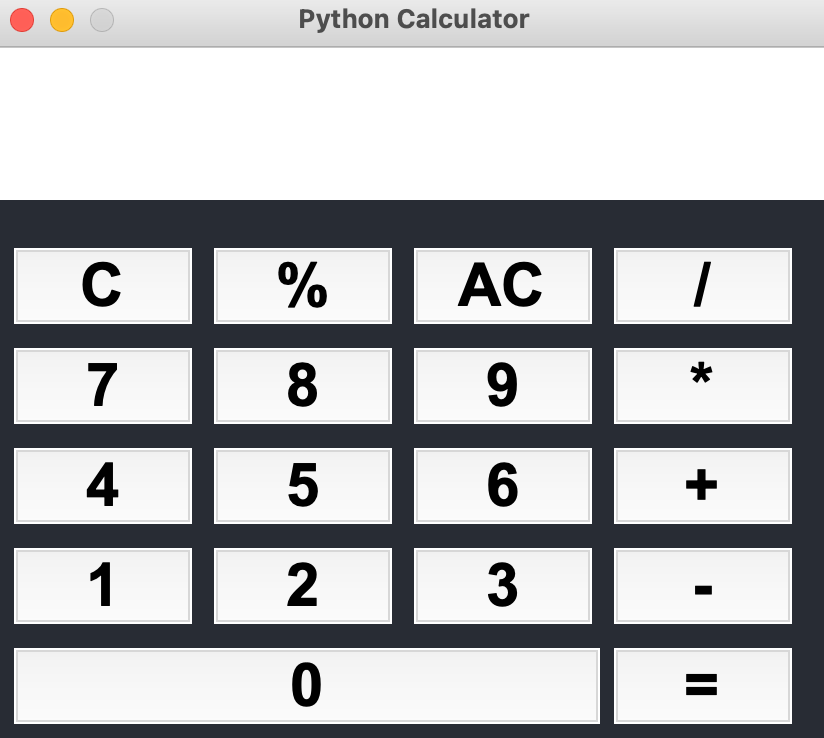

 

    
     
    <h1 align="center">Python Calculator</h1>

  <h4 align="center">
    Practical work - Python Basics
  </h4>
 

 
 

<!-- TABLE OF CONTENTS -->

  
Table of Contents

  <ol>
    <li><a href="#illustration">Illustration</a></li>
    <li><a href="#description">Description</a></li>
    <li><a href="#languages">Languages</a></li>
    <li><a href="#objectives">Objectives</a></li>
    <li><a href="#status">Status</a></li>
    <li><a href="#context">Context</a></li>
  </ol>

 
 

## ✨ Illustration 

## 🗒 Description 
- Design a Graphic Calculator
- Your calculator should have an input field
- When pressing the enter key, the result of the calculation will be displayed 
  under the input field.

## 🛠 Languages and tools
- Python
- Tkinter

## 🎯 Objectives 
- Practice basic concepts of Python
- Practice some functions (eval, configure, bind ...)

## 📈 Status 

Project completed

## 🗓 Context 

I realized this practical work during my bachelor of computer science in the Institute of technology of Vannes